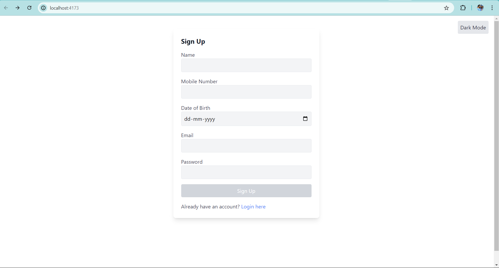
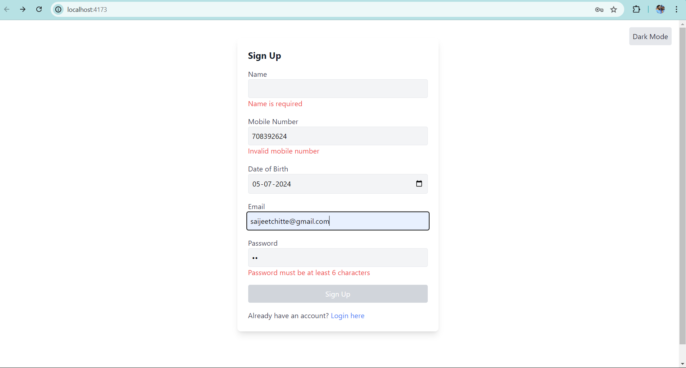
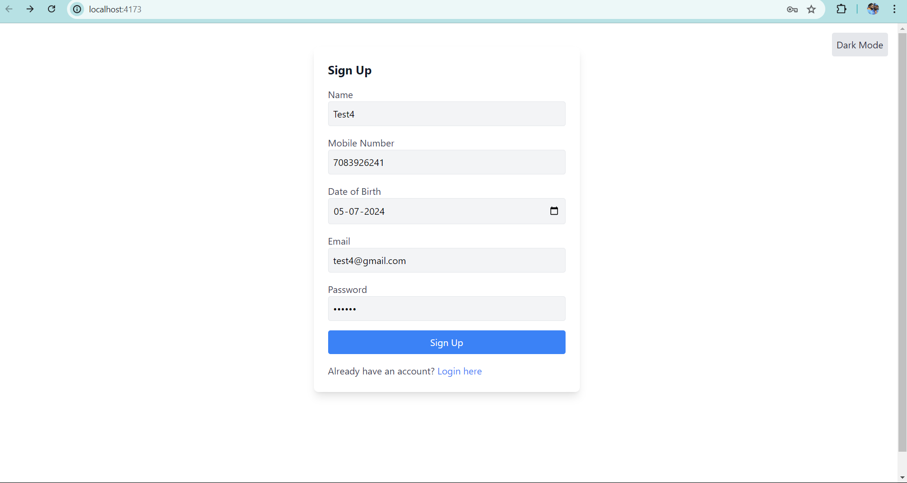
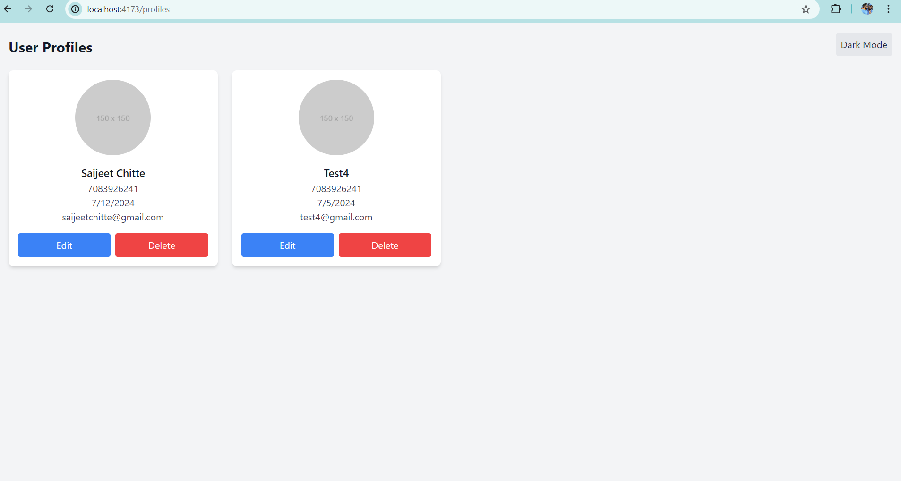
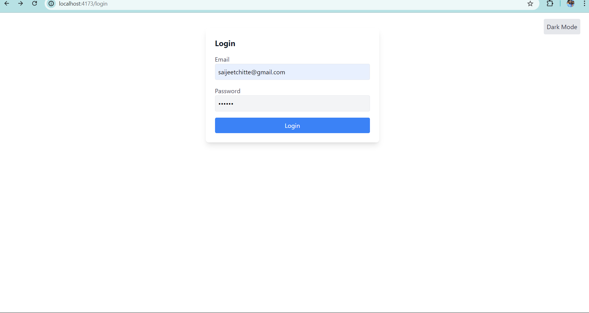
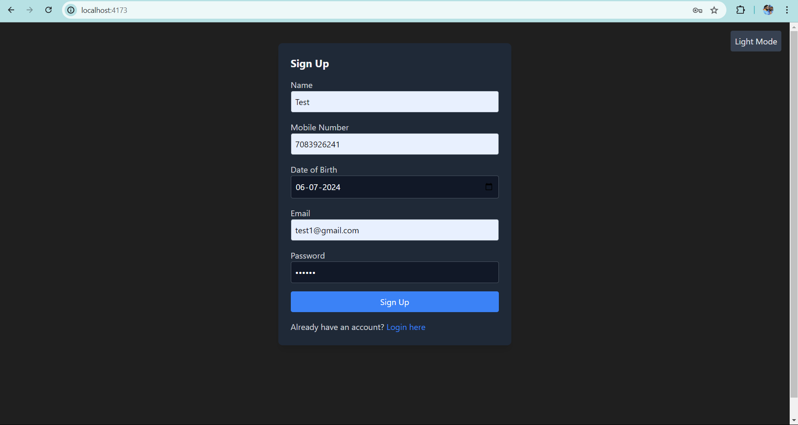
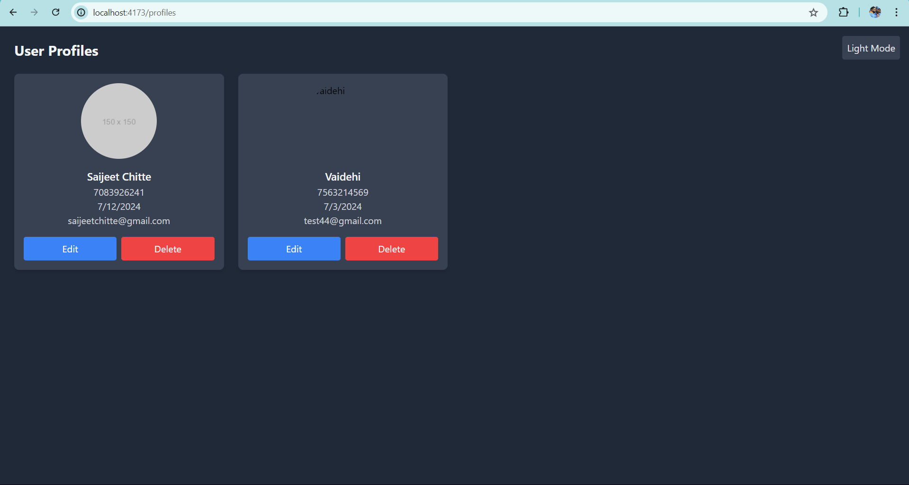
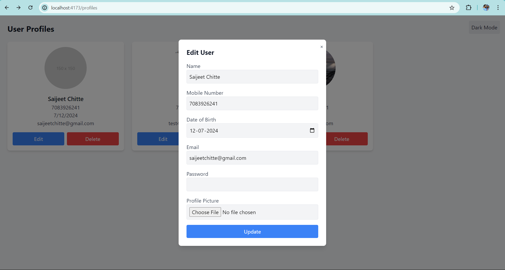

# SignUp WebAPP
 
Created a web application that allows users to sign up by filling out a form with fields like 
name, number, date of birth (DOB), email, and password. Implemented validation for each 
field, and enabled the submit button only when all fields have valid data.

Also added optional Features as well
1. Implemented a feature to edit or delete user profiles. 
2. Added additional fields to the user profile, such as a profile picture upload. 
3. Used a frontend library ReactJs for building the application.

## Project Structure

- `frontend/`: Contains the React.js application.
- `backend/`: Contains the Node.js application.
- `db/`: MongoDB Atlas

## Prerequisites

Before running the project, ensure you have the following installed:
- Node.js (v20 or later)
- npm (v10 or later) 

## Setting Up
1. Clone the repository to your local machine.
```bash
git clone https://github.com/saijeet007/Signup-Assignment.git
```

## Running the Project Locally

### Frontend

1. **Navigate to the frontend directory:**

    ```bash
    cd frontend
    ```

2. **Install dependencies:**

    ```bash
    npm install
    ```

3. **Start the frontend development server:**

    ```bash
    npm run dev
    ```

    The frontend development server should now be running on `http://localhost:5173`.

## Screenshots 
#### Sign-up Page


#### Checks for Validation


#### After filling all details correctly Signup button is enabled


#### Profile Display


#### Login Functionality 


#### Dark Mode Implementation for Signup page


#### Dark Mode Implementation for Profile Display



#### Edit User Functionality and profile picture uploading

